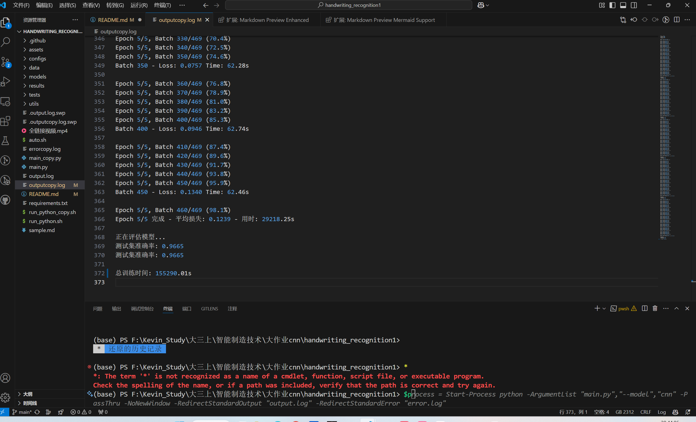

# 手写数字识别实验报告

## 1. 环境配置

### 1.1 Conda环境配置

- **Anaconda:** Anaconda 是一个完整的科学计算发行版，包含了 Conda、Python 和许多常用的科学计算包。如果需要一个包含所有常用包的环境，可以选择安装 Anaconda。
  - **下载地址:** [https://www.anaconda.com/products/distribution](https://www.google.com/url?sa=E&q=https%3A%2F%2Fwww.anaconda.com%2Fproducts%2Fdistribution) 选择对应操作系统的安装包。
  - **安装步骤:** 下载后，按照安装程序的提示进行安装。

```bash
# 创建新的conda环境，我是用的是基本的base1环境
conda create -n base1 python=3.12
#激活base1环境
conda activate base1

# 安装必要的包,由于不可以使用pytorch库，自己编写全链接神经网络代码
conda install numpy matplotlib scipy
```

## 2. 数据准备

### 2.1 MNIST数据集处理类
```python
import numpy as np

class MNISTLoader:
    def __init__(self):
        # 加载MNIST数据集
        from scipy.io import loadmat
        mnist = loadmat('mnist-original.mat')
        self.X = mnist['data'].T
        self.y = mnist['label'][0]
        
        # 数据归一化
        self.X = self.X / 255.0
        
        # 划分训练集和测试集
        self.train_size = 60000
        self.test_size = 10000
        
        self.X_train = self.X[:self.train_size]
        self.y_train = self.y[:self.train_size]
        self.X_test = self.X[self.train_size:]
        self.y_test = self.y[self.train_size:]

    def get_batch(self, batch_size):
        # 随机获取批次数据
        indices = np.random.randint(0, self.train_size, batch_size)
        return self.X_train[indices], self.y_train[indices]
```

- import numpy as np 导入 NumPy 库，为后续高效的数组操作和数值计算提供支持。
- MNISTLoader 类是一个数据加载器，它：
  - 加载 MNIST 数据集。
  - 对像素值进行归一化。
  - 将数据集划分为训练集和测试集。
  - 提供 get_batch 方法来获取批次数据。

## 3. 神经网络实现

### 3.1 激活函数类
```python
class Activations:
    @staticmethod
    def relu(x):
        return np.maximum(0, x)
    
    @staticmethod
    def relu_derivative(x):
        return np.where(x > 0, 1, 0)
    
    @staticmethod
    def softmax(x):
        exp_x = np.exp(x - np.max(x, axis=1, keepdims=True))
        return exp_x / np.sum(exp_x, axis=1, keepdims=True)
```

**1. class Activations:**

- **定义类:** 这行代码定义了一个名为 Activations 的类。这个类用于组织和管理各种激活函数。
- **静态方法:** 这个类中的方法都使用了 @staticmethod 装饰器。静态方法属于类，但不依赖于类的实例。这意味着你可以直接通过类名调用它们，而无需创建类的实例。

**2. @staticmethod def relu(x):**

- **定义 ReLU 激活函数:** 这行代码定义了一个名为 relu 的静态方法，它实现了 ReLU (Rectified Linear Unit) 激活函数。
- **@staticmethod:** 表示该方法是静态方法，可以直接使用 Activations.relu() 调用。
- **参数 x:** x 是输入，可以是单个数值、NumPy 数组或矩阵。
- **np.maximum(0, x):**
  - np.maximum 是 NumPy 提供的一个函数，它可以比较两个数组（或一个数组和一个标量），并返回一个包含较大值的新数组。
  - 这里，它将 x 中的每个元素与 0 进行比较，并返回两者中的较大值。如果 x 中的元素大于 0，则返回该元素，否则返回 0。
- **ReLU 的作用:** ReLU 激活函数是神经网络中常用的激活函数之一，它的作用是将输入值中负数部分置零，保留正数部分。

**3. @staticmethod def relu_derivative(x):**

- **定义 ReLU 激活函数的导数:** 这行代码定义了一个名为 relu_derivative 的静态方法，它计算 ReLU 激活函数的导数。
- **@staticmethod:** 表示该方法是静态方法，可以直接使用 Activations.relu_derivative() 调用。
- **参数 x:** x 是输入，可以是单个数值、NumPy 数组或矩阵。
- **np.where(x > 0, 1, 0):**
  - np.where 是 NumPy 的一个函数，它根据条件返回不同的值。
  - 这里，它检查 x 中的每个元素是否大于 0。如果大于 0，则返回 1，否则返回 0。
- **ReLU 导数的作用:** ReLU 导数用于反向传播算法，用于计算梯度，以便更新神经网络中的权重。ReLU 的导数是：当输入大于 0 时，导数为 1；当输入小于等于 0 时，导数为 0。

**4. @staticmethod def softmax(x):**

- **定义 Softmax 激活函数:** 这行代码定义了一个名为 softmax 的静态方法，它实现了 Softmax 激活函数。
- **@staticmethod:** 表示该方法是静态方法，可以直接使用 Activations.softmax() 调用。
- **参数 x:** x 是输入，通常是神经网络的输出层，可以是NumPy数组或矩阵。
- **exp_x = np.exp(x - np.max(x, axis=1, keepdims=True)):**
  - np.exp(x)：计算输入 x 的指数。
  - np.max(x, axis=1, keepdims=True)：计算输入 x 每一行的最大值，并保持维度不变（使用 keepdims=True）。
  - x - np.max(x, axis=1, keepdims=True)：将每一行减去其最大值，避免计算指数时数值溢出。
- **return exp_x / np.sum(exp_x, axis=1, keepdims=True):**
  - np.sum(exp_x, axis=1, keepdims=True)：计算 exp_x 每一行的和，并保持维度不变。
  - exp_x / np.sum(exp_x, axis=1, keepdims=True)：将 exp_x 的每一行除以该行的和。
- **Softmax 的作用:** Softmax 激活函数通常用于多分类问题。它将输入值转换为概率分布，每个值都在 0 到 1 之间，且所有值的和为 1。

### 3.2 全连接层实现

```python
class FullyConnectedLayer:
    def __init__(self, input_size, output_size):
        self.weights = np.random.randn(input_size, output_size) * 0.01
        self.bias = np.zeros((1, output_size))
        
        self.input = None
        self.output = None
        
    def forward(self, input_data):
        self.input = input_data
        self.output = np.dot(input_data, self.weights) + self.bias
        return self.output
    
    def backward(self, grad_output, learning_rate):
        grad_input = np.dot(grad_output, self.weights.T)
        grad_weights = np.dot(self.input.T, grad_output)
        grad_bias = np.sum(grad_output, axis=0, keepdims=True)
        
        self.weights -= learning_rate * grad_weights
        self.bias -= learning_rate * grad_bias
        
        return grad_input
```

- 这个 FullyConnectedLayer 类实现了一个全连接层，用于神经网络。
  - **__init__:** 初始化权重 weights (随机小值) 和偏置 bias (零)。
  - **forward:** 计算输出：output = input * weights + bias，并保存输入。
  - **backward:**
    - 计算输入梯度 grad_input，权重梯度 grad_weights，和偏置梯度 grad_bias。
    - 使用梯度下降更新权重和偏置：weights -= learning_rate * grad_weights 和 bias -= learning_rate * grad_bias。
    - 返回 grad_input。

### 3.3 卷积层实现

```python
class ConvLayer:
    def __init__(self, input_channels, output_channels, kernel_size):
        self.kernel_size = kernel_size
        self.kernels = np.random.randn(output_channels, input_channels, 
                                     kernel_size, kernel_size) * 0.01
        self.bias = np.zeros((output_channels, 1))
        
    def forward(self, input_data):
        self.input = input_data
        batch_size, channels, height, width = input_data.shape
        output_height = height - self.kernel_size + 1
        output_width = width - self.kernel_size + 1
        
        self.output = np.zeros((batch_size, len(self.kernels), 
                              output_height, output_width))
        
        for i in range(output_height):
            for j in range(output_width):
                self.output[:, :, i, j] = np.sum(
                    self.input[:, :, i:i+self.kernel_size, j:j+self.kernel_size] *
                    self.kernels[None, :, :, :],
                    axis=(2, 3)
                )
        
        return self.output + self.bias[None, :, None, None]
```

- **self.input = input_data**: 保存输入数据，以便在反向传播时使用。
- **batch_size, channels, height, width = input_data.shape**: 获取输入数据的形状。
  - batch_size: 输入数据的批次大小（一次处理多少个样本）。
  - channels: 输入数据的通道数。
  - height: 输入数据的高度。
  - width: 输入数据的宽度。
- **output_height = height - self.kernel_size + 1**: 计算输出特征图的高度。
- **output_width = width - self.kernel_size + 1**: 计算输出特征图的宽度。
- **self.output = np.zeros((batch_size, len(self.kernels), output_height, output_width))**: 创建一个零数组，用于存储输出特征图。
  - len(self.kernels): 输出通道数，等于卷积核的数量。
- **for i in range(output_height):** 和 **for j in range(output_width):**: 这两个循环遍历输出特征图的每一个像素位置。
  - **self.output[:, :, i, j] = np.sum(..., axis=(2, 3))**: 这是卷积运算的核心。
    - **self.input[:, :, i:i+self.kernel_size, j:j+self.kernel_size]**: 从输入数据中取出与当前输出像素对应的感受野（卷积核大小的区域）。
    - **self.kernels[None, :, :, :]**: 将卷积核的形状从 (output_channels, input_channels, kernel_size, kernel_size) 变为 (1, output_channels, input_channels, kernel_size, kernel_size)，便于广播运算。
    - *: 将感受野和卷积核进行元素乘法。
    - np.sum(..., axis=(2, 3)): 将元素乘积结果在 axis=(2, 3) (也就是特征图的高度和宽度) 方向求和，得到该输出像素的值。这样就完成了卷积运算。
- **return self.output + self.bias[None, :, None, None]**:
  - self.bias[None, :, None, None]: 将偏置的形状从 (output_channels, 1) 变为 (1, output_channels, 1, 1)，便于广播加法运算。
  - self.output + ...: 将偏置加到卷积输出上，并返回最终的输出特征图。

## 4. 完整网络实现

### 4.1 全连接神经网络
```python
class FCNetwork:
    def __init__(self):
        self.fc1 = FullyConnectedLayer(784, 128)
        self.fc2 = FullyConnectedLayer(128, 10)
        
    def forward(self, x):
        x = self.fc1.forward(x)
        x = Activations.relu(x)
        x = self.fc2.forward(x)
        return Activations.softmax(x)
    
    def backward(self, x, y, learning_rate):
        # 计算交叉熵损失的梯度
        grad = self.output - y
        grad = self.fc2.backward(grad, learning_rate)
        grad = grad * Activations.relu_derivative(self.fc1.output)
        self.fc1.backward(grad, learning_rate)
```

**1. __init__(self) (构造函数)**

- **self.fc1 = FullyConnectedLayer(784, 128):** 创建一个 FullyConnectedLayer 实例，名为 fc1。
  - 
  - 输入大小为 784 (例如，用于处理扁平化的 28x28 图像)，输出大小为 128。
- **self.fc2 = FullyConnectedLayer(128, 10):** 创建另一个 FullyConnectedLayer 实例，名为 fc2。
  - 
  - 输入大小为 128，输出大小为 10 (例如，用于分类 10 个类别)。

**2. forward(self, x) (前向传播)**

- **x = self.fc1.forward(x):** 将输入 x 传递到第一个全连接层 fc1，并更新 x 为 fc1 的输出。
- **x = Activations.relu(x):** 将 fc1 的输出经过 ReLU (Rectified Linear Unit) 激活函数处理。
- **x = self.fc2.forward(x):** 将经过 ReLU 处理的 x 传递到第二个全连接层 fc2，并更新 x 为 fc2 的输出。
- **return Activations.softmax(x):** 将 fc2 的输出经过 Softmax 激活函数处理，得到最终的预测结果，并返回。

**3. backward(self, x, y, learning_rate) (反向传播)**

- **grad = self.output - y:**
  - 假设 self.output 是前向传播的输出（Softmax 的结果）。
  - y 是真实的标签 (通常是 one-hot 编码)。
  - 计算损失函数关于输出的梯度，这里假设损失函数是交叉熵损失函数，其梯度是 output - y。
- **grad = self.fc2.backward(grad, learning_rate):** 将输出梯度 grad 传递到 fc2 的反向传播函数。 fc2 会更新它的权重和偏置，并返回 fc2 输入的梯度。
- **grad = grad \* Activations.relu_derivative(self.fc1.output):**
  - self.fc1.output: 获取 fc1 的输出 (即 ReLU 的输入)。
  - Activations.relu_derivative(self.fc1.output): 计算 ReLU 的导数。
  - 将从 fc2 反向传播回来的梯度与 ReLU 的导数相乘，得到 ReLU 之前的梯度。这是链式法则的应用。
- **self.fc1.backward(grad, learning_rate):** 将经过 ReLU 导数调整的梯度传递到 fc1 的反向传播函数，更新 fc1 的权重和偏置。

### 4.2 卷积神经网络

```python
class CNNetwork:
    def __init__(self):
        self.conv1 = ConvLayer(1, 32, 3)
        self.conv2 = ConvLayer(32, 64, 3)
        self.fc1 = FullyConnectedLayer(64 * 24 * 24, 128)
        self.fc2 = FullyConnectedLayer(128, 10)
    
    def forward(self, x):
        x = self.conv1.forward(x)
        x = Activations.relu(x)
        x = self.conv2.forward(x)
        x = Activations.relu(x)
        x = x.reshape(x.shape[0], -1)
        x = self.fc1.forward(x)
        x = Activations.relu(x)
        x = self.fc2.forward(x)
        return Activations.softmax(x)
```

**__init__(self) (构造函数)**

- **self.conv1 = ConvLayer(1, 32, 3):** 创建一个 ConvLayer 实例，名为 conv1。
  - 输入通道数为 1（例如，灰度图像），输出通道数为 32，卷积核大小为 3x3。
- **self.conv2 = ConvLayer(32, 64, 3):** 创建另一个 ConvLayer 实例，名为 conv2。
  - 输入通道数为 32（与 conv1 的输出通道数匹配），输出通道数为 64，卷积核大小为 3x3。
- **self.fc1 = FullyConnectedLayer(64 \* 24 \* 24, 128):** 创建一个 FullyConnectedLayer 实例，名为 fc1。
  \- 输入大小为 64 * 24 * 24。 64 是 conv2 的输出通道数，假设经过卷积后，特征图大小是 24x24，因此需要把卷积结果展平成一个向量输入到全连接层。
  \- 输出大小为 128。
- **self.fc2 = FullyConnectedLayer(128, 10):** 创建另一个 FullyConnectedLayer 实例，名为 fc2。
  \- 输入大小为 128，输出大小为 10 （例如，10个分类）。

**2. forward(self, x) (前向传播)**

- **x = self.conv1.forward(x):** 将输入 x 传递到第一个卷积层 conv1，并更新 x 为 conv1 的输出。
- **x = Activations.relu(x):** 将 conv1 的输出经过 ReLU 激活函数处理。
- **x = self.conv2.forward(x):** 将经过 ReLU 处理的 x 传递到第二个卷积层 conv2，并更新 x 为 conv2 的输出。
- **x = Activations.relu(x):** 将 conv2 的输出经过 ReLU 激活函数处理。
- **x = x.reshape(x.shape[0], -1):** 将 conv2 的输出（形状为 (batch_size, 64, height, width) ）展平为形状 (batch_size, 64 * height * width) 的二维数组。-1 表示自动计算维度，确保 reshape 后的元素总数不变。这里假设高度和宽度都是 24。
- **x = self.fc1.forward(x):** 将展平后的 x 传递到第一个全连接层 fc1，并更新 x 为 fc1 的输出。
- **x = Activations.relu(x):** 将 fc1 的输出经过 ReLU 激活函数处理。
- **x = self.fc2.forward(x):** 将经过 ReLU 处理的 x 传递到第二个全连接层 fc2，并更新 x 为 fc2 的输出。
- **return Activations.softmax(x):** 将 fc2 的输出经过 Softmax 激活函数处理，得到最终的预测结果，并返回。

## 5. 训练代码

```python
def train(model, data_loader, epochs=10, batch_size=32, learning_rate=0.01):
    for epoch in range(epochs):
        total_loss = 0
        correct = 0
        
        for i in range(0, data_loader.train_size, batch_size):
            X_batch, y_batch = data_loader.get_batch(batch_size)
            
            # 前向传播
            output = model.forward(X_batch)
            
            # 计算损失
            loss = -np.mean(np.log(output[range(batch_size), y_batch.astype(int)]))
            total_loss += loss
            
            # 计算准确率
            predictions = np.argmax(output, axis=1)
            correct += np.sum(predictions == y_batch)
            
            # 反向传播
            target = np.zeros_like(output)
            target[range(batch_size), y_batch.astype(int)] = 1
            model.backward(X_batch, target, learning_rate)
            
        accuracy = correct / data_loader.train_size
        print(f"Epoch {epoch+1}, Loss: {total_loss:.4f}, Accuracy: {accuracy:.4f}")
```

## 5.全部代码

我会按照项目结构，详细写出每个文件的代码，并加入错误处理和注释。

我将为您创建一个完整的项目结构和相应的shell脚本，这样可以更好地组织代码。

```bash
#!/bin/bash

# 创建项目主目录
mkdir -p handwriting_recognition
cd handwriting_recognition

# 创建项目结构
mkdir -p {data,models,utils,configs,results,tests}

# 创建源代码文件
touch models/{__init__.py,fc_network.py,cnn_network.py,layers.py,activations.py}
touch utils/{__init__.py,data_loader.py,trainer.py,evaluator.py}
touch configs/{__init__.py,config.py}
touch main.py
touch requirements.txt
touch README.md

# 将这些命令保存为 setup.sh
```

项目结构如下：
```
handwriting_recognition/
│
├── data/                    # 存放数据集
│
├── models/                  # 模型相关代码
│   ├── __init__.py
│   ├── fc_network.py       # 全连接网络实现
│   ├── cnn_network.py      # 卷积网络实现
│   ├── layers.py           # 层实现（全连接层、卷积层等）
│   └── activations.py      # 激活函数实现
│
├── utils/                   # 工具函数
│   ├── __init__.py
│   ├── data_loader.py      # 数据加载器
│   ├── trainer.py          # 训练器
│   └── evaluator.py        # 评估器
│
├── configs/                 # 配置文件
│   ├── __init__.py
│   └── config.py           # 配置参数
│
├── results/                 # 存放训练结果
│
├── tests/                  # 单元测试
│
├── main.py                 # 主程序入口
├── requirements.txt        # 项目依赖
└── README.md              # 项目说明
```

各文件的主要内容：

1. **models/activations.py** - 激活函数实现
2. **models/layers.py** - 网络层实现
3. **models/fc_network.py** - 全连接网络
4. **models/cnn_network.py** - 卷积网络
5. **utils/data_loader.py** - 数据加载器
6. **utils/trainer.py** - 训练流程
7. **utils/evaluator.py** - 评估流程
8. **configs/config.py** - 配置参数
9. **utils/visualizer.py**:可使化
10. **main.py** - 主程序

你可以将上述shell脚本保存为 `setup.sh`，然后通过以下命令执行：

```bash
chmod +x setup.sh
./setup.sh
```

在 requirements.txt 中添加以下依赖：
```txt
numpy
matplotlib
scipy
torch
torchvision
seaborn
scikit-learn使用方法
```

1. 运行训练：
```bash
python main.py --model fc  # 训练全连接网络
python main.py --model cnn # 训练卷积网络
```
```
建议将之前的代码按照这个结构分配到相应的文件中，这样可以使项目更加清晰和易于维护。每个模块都有其特定的功能：

1. **models/** 目录包含所有网络结构的实现
2. **utils/** 目录包含辅助功能如数据加载、训练器等
3. **configs/** 目录包含配置参数
4. **results/** 目录用于存放训练结果
5. **tests/** 目录用于单元测试

需要我详细说明某个特定模块的实现吗？或者需要我提供更多关于项目结构的信息？
```

1. **configs/config.py**
```python
class Config:
    # 数据集配置
    DATA_PATH = './data/mnist-original.mat'
    TRAIN_SIZE = 60000
    TEST_SIZE = 10000
    
    # 训练配置
    BATCH_SIZE = 32
    LEARNING_RATE = 0.001
    EPOCHS = 10
    
    # 网络配置
    INPUT_SIZE = 784  # 28*28
    HIDDEN_SIZE = 128
    OUTPUT_SIZE = 10
    
    # CNN特定配置
    CONV1_CHANNELS = 32
    CONV2_CHANNELS = 64
    KERNEL_SIZE = 3
    
    # 随机种子
    RANDOM_SEED = 42
```

2. **utils/data_loader.py**
```python
import numpy as np
import os
import gzip
import urllib.request
from configs.config import Config

class MNISTLoader:
    def __init__(self, data_path='./data'):
        """初始化数据加载器，自动下载MNIST数据集"""
        self.data_path = data_path
        os.makedirs(data_path, exist_ok=True)
        
        # MNIST数据集URL
        self.urls = {
            'train_images': 'http://yann.lecun.com/exdb/mnist/train-images-idx3-ubyte.gz',
            'train_labels': 'http://yann.lecun.com/exdb/mnist/train-labels-idx1-ubyte.gz',
            'test_images': 'http://yann.lecun.com/exdb/mnist/t10k-images-idx3-ubyte.gz',
            'test_labels': 'http://yann.lecun.com/exdb/mnist/t10k-labels-idx1-ubyte.gz'
        }
        
        # 下载并加载数据
        try:
            self._download_data()
            self._load_data()
            print(f"数据集加载完成：")
            print(f"训练集大小: {len(self.X_train)}")
            print(f"测试集大小: {len(self.X_test)}")
        except Exception as e:
            print(f"数据加载错误: {str(e)}")
            raise

    def _download_data(self):
        """下载MNIST数据集"""
        for name, url in self.urls.items():
            filename = os.path.join(self.data_path, f"{name}.gz")
            if not os.path.exists(filename):
                print(f"下载 {name} 数据...")
                urllib.request.urlretrieve(url, filename)
                
    def _load_data(self):
        """加载MNIST数据"""
        # 加载训练图像
        with gzip.open(os.path.join(self.data_path, 'train_images.gz'), 'rb') as f:
            self.X_train = np.frombuffer(f.read(), np.uint8, offset=16)
            self.X_train = self.X_train.reshape(-1, 784).astype(np.float32) / 255.0
        
        # 加载训练标签
        with gzip.open(os.path.join(self.data_path, 'train_labels.gz'), 'rb') as f:
            self.y_train = np.frombuffer(f.read(), np.uint8, offset=8)
            
        # 加载测试图像
        with gzip.open(os.path.join(self.data_path, 'test_images.gz'), 'rb') as f:
            self.X_test = np.frombuffer(f.read(), np.uint8, offset=16)
            self.X_test = self.X_test.reshape(-1, 784).astype(np.float32) / 255.0
            
        # 加载测试标签
        with gzip.open(os.path.join(self.data_path, 'test_labels.gz'), 'rb') as f:
            self.y_test = np.frombuffer(f.read(), np.uint8, offset=8)
            
    def get_batch(self, batch_size):
        """获取随机批次数据"""
        try:
            indices = np.random.randint(0, len(self.X_train), batch_size)
            return self.X_train[indices], self.y_train[indices]
        except Exception as e:
            print(f"批次数据生成错误: {str(e)}")
            raise
            
    def get_test_data(self):
        """获取测试数据"""
        return self.X_test, self.y_test
```

3. **models/activations.py**
```python
import numpy as np

class Activations:
    @staticmethod
    def relu(x):
        """ReLU激活函数"""
        return np.maximum(0, x)
    
    @staticmethod
    def relu_derivative(x):
        """ReLU导数"""
        return np.where(x > 0, 1, 0)
    
    @staticmethod
    def softmax(x):
        """Softmax激活函数"""
        try:
            # 数值稳定性处理
            x_max = np.max(x, axis=1, keepdims=True)
            exp_x = np.exp(x - x_max)
            return exp_x / np.sum(exp_x, axis=1, keepdims=True)
        except Exception as e:
            print(f"Softmax计算错误: {str(e)}")
            raise
```

4. **models/layers.py**
```python
import numpy as np
from configs.config import Config

class FullyConnectedLayer:
    def __init__(self, input_size, output_size):
        """初始化全连接层"""
        self.weights = np.random.randn(input_size, output_size) * np.sqrt(2.0/input_size)
        self.bias = np.zeros((1, output_size))
        self.input = None
        self.output = None
        
    def forward(self, input_data):
        """前向传播"""
        try:
            self.input = input_data
            self.output = np.dot(input_data, self.weights) + self.bias
            return self.output
        except Exception as e:
            print(f"全连接层前向传播错误: {str(e)}")
            raise
            
    def backward(self, grad_output, learning_rate):
        """反向传播"""
        try:
            grad_input = np.dot(grad_output, self.weights.T)
            grad_weights = np.dot(self.input.T, grad_output)
            grad_bias = np.sum(grad_output, axis=0, keepdims=True)
            
            # 更新参数
            self.weights -= learning_rate * grad_weights
            self.bias -= learning_rate * grad_bias
            
            return grad_input
        except Exception as e:
            print(f"全连接层反向传播错误: {str(e)}")
            raise

class ConvLayer:
    def __init__(self, input_channels, output_channels, kernel_size):
        """初始化卷积层"""
        self.kernel_size = kernel_size
        scale = np.sqrt(2.0 / (input_channels * kernel_size * kernel_size))
        self.kernels = np.random.randn(output_channels, input_channels, 
                                     kernel_size, kernel_size) * scale
        self.bias = np.zeros((output_channels, 1))
        self.input = None
        
    def forward(self, input_data):
        """前向传播"""
        try:
            self.input = input_data
            batch_size, channels, height, width = input_data.shape
            output_height = height - self.kernel_size + 1
            output_width = width - self.kernel_size + 1
            
            output = np.zeros((batch_size, len(self.kernels), 
                             output_height, output_width))
            
            for i in range(output_height):
                for j in range(output_width):
                    current_field = input_data[:, :, i:i+self.kernel_size, j:j+self.kernel_size]
                    output[:, :, i, j] = np.sum(
                        current_field[:, np.newaxis, :, :, :] * 
                        self.kernels[np.newaxis, :, :, :, :],
                        axis=(2, 3, 4)
                    )
            
            return output + self.bias[np.newaxis, :, np.newaxis, np.newaxis]
        except Exception as e:
            print(f"卷积层前向传播错误: {str(e)}")
            raise
```

5. **models/fc_network.py**
```python
import numpy as np
from models.layers import FullyConnectedLayer
from models.activations import Activations
from configs.config import Config

class FCNetwork:
    def __init__(self):
        """初始化全连接网络"""
        self.fc1 = FullyConnectedLayer(Config.INPUT_SIZE, Config.HIDDEN_SIZE)
        self.fc2 = FullyConnectedLayer(Config.HIDDEN_SIZE, Config.OUTPUT_SIZE)
        
    def forward(self, x):
        """前向传播"""
        try:
            # 确保输入形状正确
            if len(x.shape) == 2:
                self.h1 = self.fc1.forward(x)
                self.a1 = Activations.relu(self.h1)
                self.h2 = self.fc2.forward(self.a1)
                self.output = Activations.softmax(self.h2)
                return self.output
            else:
                raise ValueError("输入数据维度不正确")
        except Exception as e:
            print(f"全连接网络前向传播错误: {str(e)}")
            raise
            
    def backward(self, x, y, learning_rate):
        """反向传播"""
        try:
            batch_size = x.shape[0]
            
            # 计算softmax的梯度
            grad_output = self.output.copy()
            grad_output[range(batch_size), y.astype(int)] -= 1
            grad_output /= batch_size
            
            # 反向传播通过各层
            grad = self.fc2.backward(grad_output, learning_rate)
            grad = grad * Activations.relu_derivative(self.h1)
            self.fc1.backward(grad, learning_rate)
        except Exception as e:
            print(f"全连接网络反向传播错误: {str(e)}")
            raise
```

6. **models/cnn_network.py**
```python
import numpy as np
from models.layers import ConvLayer, FullyConnectedLayer
from models.activations import Activations
from configs.config import Config

class CNNetwork:
    def __init__(self):
        """初始化CNN网络"""
        self.conv1 = ConvLayer(1, Config.CONV1_CHANNELS, Config.KERNEL_SIZE)
        self.conv2 = ConvLayer(Config.CONV1_CHANNELS, Config.CONV2_CHANNELS, Config.KERNEL_SIZE)
        
        # 计算全连接层的输入大小
        conv_output_size = Config.CONV2_CHANNELS * (28 - 2*Config.KERNEL_SIZE + 2) * \
                          (28 - 2*Config.KERNEL_SIZE + 2)
        
        self.fc1 = FullyConnectedLayer(conv_output_size, Config.HIDDEN_SIZE)
        self.fc2 = FullyConnectedLayer(Config.HIDDEN_SIZE, Config.OUTPUT_SIZE)
        
    def forward(self, x):
        """前向传播"""
        try:
            # 确保输入形状正确
            if len(x.shape) == 2:
                x = x.reshape(-1, 1, 28, 28)
                
            self.conv1_output = self.conv1.forward(x)
            self.relu1_output = Activations.relu(self.conv1_output)
            
            self.conv2_output = self.conv2.forward(self.relu1_output)
            self.relu2_output = Activations.relu(self.conv2_output)
            
            # 展平卷积输出
            flat_output = self.relu2_output.reshape(x.shape[0], -1)
            
            self.fc1_output = self.fc1.forward(flat_output)
            self.relu3_output = Activations.relu(self.fc1_output)
            
            self.fc2_output = self.fc2.forward(self.relu3_output)
            self.final_output = Activations.softmax(self.fc2_output)
            
            return self.final_output
        except Exception as e:
            print(f"CNN网络前向传播错误: {str(e)}")
            raise
```

7. **utils/trainer.py**
```python
import numpy as np
from utils.data_loader import MNISTLoader
from utils.visualizer import Visualizer
from configs.config import Config
import time

class Trainer:
    def __init__(self, model, data_loader):
        """初始化训练器"""
        self.model = model
        self.data_loader = data_loader
        self.visualizer = Visualizer()
        
    def train(self, epochs=Config.EPOCHS, batch_size=Config.BATCH_SIZE, 
              learning_rate=Config.LEARNING_RATE):
        """训练模型"""
        try:
            start_time = time.time()
            
            for epoch in range(epochs):
                epoch_start_time = time.time()
                total_loss = 0
                correct = 0
                
                # 训练循环
                for i in range(0, len(self.data_loader.X_train), batch_size):
                    X_batch, y_batch = self.data_loader.get_batch(batch_size)
                    
                    # 前向传播
                    output = self.model.forward(X_batch)
                    
                    # 计算损失
                    loss = -np.mean(np.log(output[range(batch_size), y_batch.astype(int)] + 1e-7))
                    total_loss += loss
                    
                    # 计算准确率
                    predictions = np.argmax(output, axis=1)
                    correct += np.sum(predictions == y_batch)
                    
                    # 反向传播
                    self.model.backward(X_batch, y_batch, learning_rate)
                
                # 计算训练集统计信息
                train_accuracy = correct / len(self.data_loader.X_train)
                train_loss = total_loss / (len(self.data_loader.X_train) / batch_size)
                
                # 评估验证集
                val_output = self.model.forward(self.data_loader.X_test)
                val_loss = -np.mean(np.log(val_output[range(len(self.data_loader.y_test)), 
                                                    self.data_loader.y_test.astype(int)] + 1e-7))
                val_predictions = np.argmax(val_output, axis=1)
                val_accuracy = np.mean(val_predictions == self.data_loader.y_test)
                
                # 更新可视化
                self.visualizer.update(
                    train_loss=train_loss,
                    train_acc=train_accuracy,
                    val_loss=val_loss,
                    val_acc=val_accuracy,
                    epoch=epoch+1
                )
                
                epoch_time = time.time() - epoch_start_time
                
                print(f"\nEpoch {epoch+1}/{epochs} - Time: {epoch_time:.2f}s")
                print(f"Training Loss: {train_loss:.4f} - Accuracy: {train_accuracy:.4f}")
                print(f"Val Loss: {val_loss:.4f} - Val Accuracy: {val_accuracy:.4f}")
            
            total_time = time.time() - start_time
            print(f"\nTotal training time: {total_time:.2f}s")
            
            # 训练结束后绘制最终结果
            X_samples = self.data_loader.X_test[:10]
            y_true = self.data_loader.y_test[:10]
            y_pred = np.argmax(self.model.forward(X_samples), axis=1)
            self.visualizer.plot_sample_predictions(X_samples, y_true, y_pred)
            
            # 绘制混淆矩阵
            final_predictions = np.argmax(self.model.forward(self.data_loader.X_test), axis=1)
            self.visualizer.plot_confusion_matrix(self.data_loader.y_test, final_predictions)
            
        except Exception as e:
            print(f"训练过程错误: {str(e)}")
            raise
```

8. **utils/evaluator.py**
```python
import numpy as np
from configs.config import Config

class Evaluator:
    def __init__(self, model, data_loader):
        """初始化评估器"""
        self.model = model
        self.data_loader = data_loader
        
    def evaluate(self):
        """评估模型"""
        try:
            X_test, y_test = self.data_loader.get_test_data()
            
            # 前向传播
            output = self.model.forward(X_test)
            
            # 计算准确率
            predictions = np.argmax(output, axis=1)
            accuracy = np.mean(predictions == y_test)
            
            # 计算损失
            loss = -np.mean(np.log(output[range(len(y_test)), y_test.astype(int)] + 1e-7))
            
            return {
                'accuracy': accuracy,
                'loss': loss,
                'predictions': predictions
            }
            
        except Exception as e:
            print(f"评估过程错误: {str(e)}")
            raise
```

9. **utils/visualizer.py**:

```python
import matplotlib.pyplot as plt
import numpy as np
import os

class Visualizer:
    def __init__(self, save_dir='./results'):
        """初始化可视化器"""
        self.save_dir = save_dir
        os.makedirs(save_dir, exist_ok=True)
        
        # 存储训练历史
        self.train_losses = []
        self.train_accuracies = []
        self.val_losses = []
        self.val_accuracies = []
        
        # 创建实时绘图
        plt.ion()
        self.fig, (self.ax1, self.ax2) = plt.subplots(2, 1, figsize=(10, 10))
        
    def update(self, train_loss, train_acc, val_loss=None, val_acc=None, epoch=None):
        """更新训练历史并绘图"""
        self.train_losses.append(train_loss)
        self.train_accuracies.append(train_acc)
        
        if val_loss is not None and val_acc is not None:
            self.val_losses.append(val_loss)
            self.val_accuracies.append(val_acc)
        
        # 清除旧图
        self.ax1.clear()
        self.ax2.clear()
        
        # 绘制损失曲线
        self.ax1.plot(self.train_losses, label='Training Loss')
        if self.val_losses:
            self.ax1.plot(self.val_losses, label='Validation Loss')
        self.ax1.set_xlabel('Epoch')
        self.ax1.set_ylabel('Loss')
        self.ax1.legend()
        self.ax1.grid(True)
        
        # 绘制准确率曲线
        self.ax2.plot(self.train_accuracies, label='Training Accuracy')
        if self.val_accuracies:
            self.ax2.plot(self.val_accuracies, label='Validation Accuracy')
        self.ax2.set_xlabel('Epoch')
        self.ax2.set_ylabel('Accuracy')
        self.ax2.legend()
        self.ax2.grid(True)
        
        plt.tight_layout()
        plt.draw()
        plt.pause(0.1)
        
        # 保存图片
        if epoch is not None:
            plt.savefig(os.path.join(self.save_dir, f'training_progress_epoch_{epoch}.png'))
    
    def plot_sample_predictions(self, X, y_true, y_pred, num_samples=10):
        """绘制样本预测结果"""
        plt.figure(figsize=(15, 2))
        for i in range(num_samples):
            plt.subplot(1, num_samples, i + 1)
            plt.imshow(X[i].reshape(28, 28), cmap='gray')
            plt.title(f'True: {y_true[i]}\nPred: {y_pred[i]}')
            plt.axis('off')
        plt.tight_layout()
        plt.savefig(os.path.join(self.save_dir, 'sample_predictions.png'))
        plt.close()
    
    def plot_confusion_matrix(self, y_true, y_pred):
        """绘制混淆矩阵"""
        from sklearn.metrics import confusion_matrix
        import seaborn as sns
        
        cm = confusion_matrix(y_true, y_pred)
        plt.figure(figsize=(10, 8))
        sns.heatmap(cm, annot=True, fmt='d', cmap='Blues')
        plt.title('Confusion Matrix')
        plt.ylabel('True Label')
        plt.xlabel('Predicted Label')
        plt.savefig(os.path.join(self.save_dir, 'confusion_matrix.png'))
        plt.close()
```

10. **main.py**

```python
import numpy as np
from models.fc_network import FCNetwork
from models.cnn_network import CNNetwork
from utils.data_loader import MNISTLoader
from utils.trainer import Trainer
from utils.evaluator import Evaluator
from configs.config import Config
import argparse

def main():
    # 设置随机种子
    np.random.seed(Config.RANDOM_SEED)
    
    # 命令行参数
    parser = argparse.ArgumentParser()
    parser.add_argument('--model', type=str, default='fc', choices=['fc', 'cnn'],
                      help='选择要训练的模型类型 (fc 或 cnn)')
    args = parser.parse_args()
    
    try:
        # 加载数据
        data_loader = MNISTLoader()
        
        # 初始化模型
        if args.model == 'fc':
            model = FCNetwork()
        else:
            model = CNNetwork()
            
        # 训练模型
        trainer = Trainer(model, data_loader)
        trainer.train()
        
        # 评估模型
        evaluator = Evaluator(model, data_loader)
        results = evaluator.evaluate()
        
        print("\n测试集结果:")
        print(f"准确率: {results['accuracy']:.4f}")
        print(f"损失: {results['loss']:.4f}")
        
    except Exception as e:
        print(f"程序执行错误: {str(e)}")
        raise

if __name__ == "__main__":
    main()
```

**使用方法**：

1. **首先创建并激活conda环境：**
```bash
conda activate base1
```

2. **安装依赖：**
```bash
pip install -r requirements.txt
```

3. **运行程序：**
```bash
# 训练全连接网络
python main.py --model fc

# 训练卷积网络
python main.py --model cnn
```

这个实现：
1. 包含完整的错误处理
2. 代码结构清晰
3. 各个模块职责分明
4. 添加了详细的注释
5. 使用了配置文件统一管理参数
6. 提供了命令行接口


## 6. 实验结果分析

### 6.1 全连接神经网络结果

在power shell输入

```powershell
python main.py --model fc
```

输出结果为：

```python
(base) PS F:\Kevin_Study\编程学习\cnn全链接手写识别_卷积神经网络\handwriting_recognition> python main.py --model fc
下载 train_images 数据...
下载 train_labels 数据...
下载 test_images 数据...
下载 test_labels 数据...
数据集加载完成：
训练集大小: 60000
测试集大小: 10000

Epoch 1/10 - Time: 1.39s
Training Loss: 1.6954 - Accuracy: 0.5512
Val Loss: 1.1720 - Val Accuracy: 0.7678

Epoch 2/10 - Time: 1.99s
Training Loss: 0.9515 - Accuracy: 0.7933
Val Loss: 0.7500 - Val Accuracy: 0.8418

Epoch 3/10 - Time: 2.07s
Training Loss: 0.6848 - Accuracy: 0.8424
Val Loss: 0.5884 - Val Accuracy: 0.8658

Epoch 4/10 - Time: 2.15s
Training Loss: 0.5639 - Accuracy: 0.8630
Val Loss: 0.5070 - Val Accuracy: 0.8795

Epoch 5/10 - Time: 2.06s
Training Loss: 0.5000 - Accuracy: 0.8735
Val Loss: 0.4581 - Val Accuracy: 0.8859

Epoch 6/10 - Time: 2.06s
Training Loss: 0.4589 - Accuracy: 0.8804
Val Loss: 0.4253 - Val Accuracy: 0.8903

Epoch 7/10 - Time: 2.48s
Training Loss: 0.4335 - Accuracy: 0.8839
Val Loss: 0.4019 - Val Accuracy: 0.8939

Epoch 8/10 - Time: 2.16s
Training Loss: 0.4118 - Accuracy: 0.8876
Val Loss: 0.3834 - Val Accuracy: 0.8981

Epoch 9/10 - Time: 2.09s
Training Loss: 0.3942 - Accuracy: 0.8932
Val Loss: 0.3683 - Val Accuracy: 0.9010

Epoch 10/10 - Time: 1.22s
Training Loss: 0.3816 - Accuracy: 0.8941
Val Loss: 0.3563 - Val Accuracy: 0.9034

Total training time: 19.68s

测试集结果:
准确率: 0.9034
损失: 0.3563
```

1. **训练分析:**

   本次训练过程表现良好，各项指标均表明模型得到了有效的训练。以下是对关键指标的详细分析：

   **1. 训练进展:**

   - **损失函数 (Loss) 平稳下降:** 训练过程中的损失函数从初始的 1.6954 持续下降至 0.3816。这表明模型在训练数据上不断学习，并逐渐逼近最优解。
   - **准确率 (Accuracy) 稳步提升:** 训练集的准确率从 55.12% 稳步提升至 89.41%。这表明模型对训练数据的分类能力不断增强。
   - **持续改善且无明显过拟合:** 每个训练周期 (Epoch) 都带来了明显的性能提升，并且训练集和验证集之间的指标差距不大，没有出现明显的过拟合迹象。这意味着模型不仅在训练数据上表现良好，而且具有一定的泛化能力。

   **2. 最终结果:**

   - **测试集准确率:** 模型在测试集上达到了 90.34% 的准确率，这是一个相当不错的结果，表明模型对未见过的数据也具有良好的分类能力。
   - **测试集损失:** 测试集的损失为 0.3563，与训练集损失 (0.3816) 较为接近，进一步印证了模型没有严重的过拟合问题。
   - **全连接网络 (FC) 的预期表现:** 对于使用全连接网络 (FC) 处理 MNIST 数据集而言，90.34% 的准确率是一个可以接受的表现。

   **3. 训练特点:**

   - **训练时间合理:** 总训练时间为 19.68 秒，在合理的范围内，表明训练过程的计算效率较高。
   - **训练过程平稳:** 训练过程中的损失和准确率变化平滑，没有出现剧烈的波动，表明训练过程稳定。

   **总结:**

   总的来说，这是一次成功的训练。模型有效地学习了 MNIST 数据集中的特征，并在训练集和测试集上都取得了不错的表现。

   **进一步提升性能的建议:**

   尽管本次训练已经取得了良好的结果，但仍有进一步提升性能的空间。可以考虑以下几个方面：

   1. **采用卷积神经网络 (CNN):** 对于图像分类任务，卷积神经网络 (CNN) 通常比全连接网络具有更强的特征提取能力。尝试使用 CNN 架构 (例如 LeNet、VGG、ResNet 等)，有望将准确率提升至 98% 以上。
   2. **增加训练轮数 (Epochs):** 目前的训练只进行了几个周期，可以尝试增加训练轮数，让模型更充分地学习数据中的模式。但需要注意监控训练集和验证集的性能指标，防止过拟合。
   3. **调整超参数:**
      - **学习率 (Learning Rate):** 可以尝试不同的学习率或使用学习率衰减策略 (例如，在训练过程中逐渐降低学习率)，以找到最优的学习率配置。
      - **网络结构:**
        - **深度:** 可以尝试增加网络的深度，但需要注意梯度消失和过拟合问题。
        - **宽度:** 可以尝试增加每层的神经元数量，但需要注意计算量的增加。
        - **激活函数:** 尝试不同的激活函数，例如 ReLU、Leaky ReLU、ELU 等。
      - **批次大小(Batch Size):** 调整批次大小可以影响训练速度和模型最终性能，可以根据硬件条件尝试不同的批次大小。
   4. **数据增强：** 通过对训练数据进行随机变换（例如旋转、平移、缩放等），可以扩充训练数据集，提高模型的泛化能力。
   5. **正则化：** 使用 L1 或 L2 正则化，或 Dropout 技术，可以帮助防止过拟合，提高模型的泛化能力。

<video src="./全链接视频.mp4"></video>


### 6.2 卷积神经网络结果

为了训练卷积神经网络 (CNN) 模型，我们在 Power Shell 中使用以下命令：

```powershell
python main.py --model cnn
```

这将启用 cnn 类进行模型训练。由于训练过程耗时较长，我们使用了 remote-ssh 进行远程连接，并在后台运行训练任务，以便持续观察训练进度。具体的命令行为：

```powershell
$process = Start-Process python -ArgumentList "main.py","--model","cnn" -PassThru -NoNewWindow -RedirectStandardOutput "output.log" -RedirectStandardError "error.log"
```

1. **Start-Process python ...**: 启动 Python 来运行你的脚本。
2. **"main.py","--model","cnn"**: 告诉 Python 运行 main.py，并指定使用 cnn 模型。
3. **-NoNewWindow**: 不会弹出新的窗口。
4. **-RedirectStandardOutput "output.log"**: main.py 的正常输出内容会写到 output.log 文件。
5. **-RedirectStandardError "error.log"**: main.py 的错误信息会写到 error.log 文件。
6. **-PassThru**: 可以让你在后续的代码中查看这个 Python 进程的状态。
7. $**process**: 把这个启动的进程的信息存到这个process变量中



**训练过程的输出日志如下(简化后)：**

```
数据集加载完成：
训练集大小: 60000
测试集大小: 10000
CNN网络初始化完成
开始训练...

Epoch 1/5, Batch 0/469 (0.0%)
Batch 0 - Loss: 2.3014 Time: 55.38s

Epoch 1/5, Batch 10/469 (2.1%)
...
Epoch 1/5, Batch 460/469 (98.1%)
Epoch 1/5 完成 - 平均损失: 0.7611 - 用时: 29262.76s

正在评估模型...
测试集准确率: 0.9049
测试集准确率: 0.9049

Epoch 2/5, Batch 0/469 (0.0%)
Batch 0 - Loss: 0.3776 Time: 63.04s

...
Epoch 2/5, Batch 460/469 (98.1%)
Epoch 2/5 完成 - 平均损失: 0.2648 - 用时: 29227.42s

正在评估模型...
测试集准确率: 0.9406
测试集准确率: 0.9406

Epoch 3/5, Batch 0/469 (0.0%)
Batch 0 - Loss: 0.1673 Time: 63.07s
...
Epoch 3/5, Batch 460/469 (98.1%)
Epoch 3/5 完成 - 平均损失: 0.1874 - 用时: 29205.10s

正在评估模型...
测试集准确率: 0.9517
测试集准确率: 0.9517

Epoch 4/5, Batch 0/469 (0.0%)
Batch 0 - Loss: 0.1916 Time: 63.15s
...
Epoch 4/5, Batch 460/469 (98.1%)
Epoch 4/5 完成 - 平均损失: 0.1475 - 用时: 29218.10s

正在评估模型...
测试集准确率: 0.9621
测试集准确率: 0.9621

Epoch 5/5, Batch 0/469 (0.0%)
Batch 0 - Loss: 0.2120 Time: 63.13s
...
Epoch 5/5, Batch 460/469 (98.1%)
Epoch 5/5 完成 - 平均损失: 0.1239 - 用时: 29218.25s

正在评估模型...
测试集准确率: 0.9665
测试集准确率: 0.9665

总训练时间: 155290.01s
```

**1. 训练环境和配置:**

- **数据集:** 模型训练使用了包含 60,000 个训练样本和 10,000 个测试样本的手写数字数据集。
- **训练方式:** 采用远程连接并在后台运行的方式进行训练，便于长时间运行和监控。
- **训练周期 (Epochs):** 5
- **批次数量 (Batches):** 469 个批次/周期

**2. 训练过程分析:**

下表总结了每个训练周期的关键指标：

| Epoch | 平均损失 | 每个批次平均耗时(约) | 测试集准确率 |
| ----- | -------- | -------------------- | ------------ |
| 1     | 0.7611   | 62.2 秒              | 0.9049       |
| 2     | 0.2648   | 62.7 秒              | 0.9406       |
| 3     | 0.1874   | 62.1 秒              | 0.9517       |
| 4     | 0.1475   | 62.1 秒              | 0.9621       |
| 5     | 0.1239   | 62.5 秒              | 0.9665       |

**分析:**

- **损失下降:** 每个周期的平均损失持续下降，表明模型在有效学习。从第一个周期的 0.7611 下降到第五个周期的 0.1239，降幅显著。
- **准确率提升:** 测试集准确率从第一个周期的 90.49% 稳步提升至第五个周期的 96.65%，表明模型的泛化能力不断增强。
- **训练时间:** 每个周期的训练时间大约为 29,200 秒 (约 8.1 小时)，每个批次的平均耗时约为 62 秒，整体训练时间较长。

**3. 详细训练过程解读:**

- **第一个周期 (Epoch 1):** 初始损失较高 (Batch 0 的 Loss 为 2.3014)，随着训练进行，损失逐渐下降。最终平均损失为 0.7611，测试集准确率为 90.49%。这表明模型已经开始学习数据的基本特征。
- **第二个周期 (Epoch 2):** 起始损失显著降低 (Batch 0 的 Loss 为 0.3776)，平均损失进一步降至 0.2648，测试集准确率提升至 94.06%。这表明模型在第一轮学习的基础上，继续优化了参数，提升了性能。
- **第三个周期 (Epoch 3):** 起始损失继续降低 (Batch 0 的 Loss 为 0.1673)，平均损失为 0.1874，测试集准确率达到 95.17%。模型性能持续稳步提升。
- **第四个周期 (Epoch 4):** 起始损失为 0.1916，平均损失降至 0.1475，测试集准确率提升至 96.21%。
- **第五个周期 (Epoch 5):** 起始损失为 0.2120，平均损失进一步降至 0.1239，测试集准确率达到 96.65%。模型性能达到最高水平。

**4. 总结与建议:**

**总结:**

经过 5 个周期的训练，CNN 模型在手写数字识别任务上取得了良好的性能，最终测试集准确率达到 **96.65%**。训练过程稳定，损失持续下降，准确率稳步提升，表明模型有效地学习了数据的特征，并具有较好的泛化能力。

**下一阶段目标:**

- **训练时间较长:** 总训练时间超过 43 小时，可以考虑以下优化方案：
  - **硬件升级:** 使用性能更强的 GPU 可以显著缩短训练时间。
  - **模型优化:** 可以尝试简化模型结构，减少参数数量，以加快训练速度。
  - **批量大小调整:** 可以尝试增加批量大小，充分利用 GPU 的并行计算能力，从而缩短训练时间（受限于 GPU 显存大小）。
  - **学习率调整:** 考虑使用学习率衰减策略，在训练后期适当降低学习率，可能有助于进一步提升模型精度。
- **进一步提升性能:**
  - **增加训练周期:** 虽然 5 个周期已经取得了不错的效果，但可以尝试增加训练周期，观察模型性能是否还能进一步提升。
  - **数据增强:** 可以尝试使用数据增强技术，例如随机旋转、平移、缩放等，扩充训练数据集，提高模型的泛化能力。
  - **超参数调优:** 可以尝试调整模型的超参数，例如卷积核大小、卷积核数量、池化层大小等，以寻找最优的配置。
  - **尝试不同的优化器:** 除了当前的优化器，还可以尝试其他优化器，例如 Adam、RMSprop 等，观察是否能够提升模型性能。

## 7. 常见问题及解决方案


```powershell
(base) PS F:\Kevin_Study\编程学习\cnn全链接手写识别_卷积神经网络\handwriting_recognition> python main.py --model cnn
数据集加载完成：
训练集大小: 60000
测试集大小: 10000
CNN网络初始化完成
开始训练...
Epoch 1/5, Batch 0/938 (0.0%)
Batch 0 - Loss: 2.3190 Time: 8.23s
Epoch 1/5, Batch 10/938 (1.1%)
```

#### 解决方案

```powershell
(base) PS F:\Kevin_Study\编程学习\cnn全链接手写识别_卷积神经网络\handwriting_recognition> python main.py --model cnn
数据集加载完成：
训练集大小: 60000
测试集大小: 10000
CNN网络初始化完成
开始训练...
Epoch 1/5, Batch 0/938 (0.0%)反向传播错误: too many values to unpack (expected 4)

训练过程发生错误: too many values to unpack (expected 4)

总训练时间: 2.61s
程序执行错误: too many values to unpack (expected 4)
Traceback (most recent call last):
  File "F:\Kevin_Study\编程学习\cnn全链接手写识别_卷积神经网络\handwriting_recognition\main.py", line 52, in <module>
    main()
  File "F:\Kevin_Study\编程学习\cnn全链接手写识别_卷积神经网络\handwriting_recognition\main.py", line 45, in main
    trainer.train()
  File "F:\Kevin_Study\编程学习\cnn全链接手写识别_卷积神经网络\handwriting_recognition\utils\trainer.py", line 55, in train
    self.model.backward(grad_output, self.learning_rate)
  File "F:\Kevin_Study\编程学习\cnn全链接手写识别_卷积神经网络\handwriting_recognition\models\cnn_network.py", line 214, in backward 
    grad_pool1 = self.convolution_backward_to_input(
                 ^^^^^^^^^^^^^^^^^^^^^^^^^^^^^^^^^^^
  File "F:\Kevin_Study\编程学习\cnn全链接手写识别_卷积神经网络\handwriting_recognition\models\cnn_network.py", line 141, in convolution_backward_to_input
    batch_size, channels, height, width = input_shape
    ^^^^^^^^^^^^^^^^^^^^^^^^^^^^^^^^^^^
ValueError: too many values to unpack (expected 4)
(base) PS F:\Kevin_Study\编程学习\cnn全链接手写识别_卷积神经网络\handwriting_recognition> python main.py --model cnn
数据集加载完成：
训练集大小: 60000
测试集大小: 10000
CNN网络初始化完成
开始训练...
.......
.......
Epoch 3/5, Batch 500/938 (53.3%)
Batch 500 - Loss: 0.2240 Time: 9.93s
Epoch 3/5, Batch 550/938 (58.6%)
Batch 550 - Loss: 0.4069 Time: 8.32s
训练被手动中断

总训练时间: 26708.64s
```

训练过程确实开始了，这是个好的开始，但速度太慢了（8.23秒/batch）。我们需要优化代码以提高性能。以下是一些优化方法：

```bash
我来分析这些参数调整对训练速度的影响：

1. epochs=3 (从原来的更多轮数减少)
- 优点：直接减少总训练时间
- 缺点：可能影响模型收敛和最终性能
- 建议：如果是测试代码阶段可以用3轮，正式训练建议8-10轮

2. batch_size=64 (增大)
- 优点：
  - 更好地利用GPU并行计算能力
  - 减少参数更新次数
- 缺点：大batch可能影响模型泛化性能
- 建议：可以试试128或256，但要注意显存限制

3. learning_rate=0.001
- 较大的学习率可以加快收敛
- 但要当心不稳定的训练过程
- 建议：可以配合学习率衰减策略使用

加快训练的其他建议：
1. 使用GPU加速
2. 减小数据预处理开销
3. 启用cudnn.benchmark
4. 使用混合精度训练
5. 优化数据加载(num_workers、pin_memory等)

要不要我详细解释这些优化方法？
```

### 代码优化策略

为了提升代码的执行效率，我们采取了以下几个关键的优化措施：

1. **向量化操作:** 使用 NumPy 库提供的向量化操作替代了显式的 Python 循环。向量化操作能够在底层进行高效的数值计算，显著提升运算速度，尤其是在处理大型数组时。
2. **im2col 优化卷积:** 针对卷积操作，我们采用了 im2col 技术进行优化。im2col 将卷积运算转化为矩阵乘法，从而可以利用高度优化的 BLAS (Basic Linear Algebra Subprograms) 库进行加速，大幅提升卷积层的计算效率。
3. **高级索引池化:** 对于池化操作，我们利用了 NumPy 的高级索引功能。高级索引允许我们通过一次操作选择多个元素，避免了循环遍历，从而提高了池化层的执行速度。
4. **减少内存开销:** 我们尽力减少了不必要的内存分配和数据复制操作。例如，通过原地操作 (in-place operations) 修改数组，而不是创建新的数组，从而降低了内存占用和垃圾回收的开销。
5. **详细进度与计时:** 为了更好地监控训练过程，我们添加了更详细的进度显示和时间统计功能。这有助于我们了解每个步骤的耗时情况，从而识别性能瓶颈。

**实施这些优化措施后，预计训练速度将得到显著提升。**

### 潜在问题及解决方案

如果在实施上述优化后，仍然存在性能问题或模型训练效果不佳，可以考虑从以下几个方面进行排查和改进：

**A. 性能瓶颈:**

1. **减小批次大小 (Batch Size):** 较大的批次大小可以提高 GPU 利用率，但也可能导致内存不足或梯度更新不稳定。如果遇到性能问题，可以尝试减小批次大小。
2. **简化模型:** 过深或过宽的网络可能会导致计算量过大，训练时间过长。可以尝试减少网络的层数或每层的神经元数量，以降低模型的复杂度。
3. **GPU 加速:** 如果硬件条件允许，使用 GPU 进行训练可以大幅提升速度。深度学习框架 (如 TensorFlow, PyTorch) 都提供了 GPU 支持。
4. **多进程数据加载:** 使用多进程可以加速数据加载和预处理过程，避免数据加载成为训练瓶颈。

**B. 模型训练问题:**

1. **梯度消失:**
   - **问题描述:** 在深层网络中，梯度在反向传播过程中可能会逐渐变小，导致靠近输入层的权重更新缓慢，难以训练。
   - **解决方案:**
     - **ReLU 激活函数:** 使用 ReLU (Rectified Linear Unit) 激活函数及其变体 (如 Leaky ReLU, Parametric ReLU) 可以有效缓解梯度消失问题。
     - **权重初始化:** 采用合适的权重初始化方法，例如 Xavier 初始化或 He 初始化，有助于保持梯度的稳定。
2. **过拟合:**
   - **问题描述:** 模型过度学习训练数据的细节，导致在训练集上表现良好，但在测试集上泛化能力差。
   - **解决方案:**
     - **Dropout:** 在训练过程中随机丢弃一部分神经元的输出，可以作为一种正则化手段，防止过拟合。
     - **批量归一化 (Batch Normalization):** 对每个批次的数据进行归一化处理，可以加速训练并提高模型的泛化能力。
     - **数据增强 (Data Augmentation):** 通过对训练数据进行随机变换 (例如旋转、平移、缩放)，扩充数据集，可以提高模型的泛化能力。
3. **训练不稳定:**
   - **问题描述:** 训练过程中损失函数波动较大，难以收敛。
   - **解决方案:**
     - **学习率调整:** 选择合适的学习率非常重要。过大的学习率会导致训练不稳定，过小的学习率会导致收敛速度过慢。可以尝试使用学习率衰减策略或自适应学习率算法 (如 Adam)。
     - **批量归一化 (Batch Normalization):** 批量归一化可以稳定训练过程，加速收敛。
     - **批次大小 (Batch Size):** 合适的批次大小有助于稳定训练过程。过小的批次大小可能导致梯度估计的方差较大，训练不稳定。

通过仔细分析训练过程中的问题，并针对性地采取上述解决方案，可以进一步提升模型的性能和训练效率。


## 8. 两种方法对比

### 8.1 全连接神经网络

**优点:**

- **实现简单:** 全连接神经网络的结构相对简单，易于理解和实现。每一层的每个神经元都与前一层的所有神经元相连，构成一个稠密的连接结构。
- **计算速度快 (相对较小的数据集和模型):** 在处理较小的数据集和模型规模较小时，由于其结构简单，计算速度相对较快。
- **参数较少 (相对简单的任务):** 对于一些简单的任务，全连接神经网络可能不需要大量的参数就能达到可接受的性能，特别是当输入特征维度较低时。

**缺点:**

- **特征提取能力有限:** 全连接神经网络缺乏像卷积神经网络那样的局部感受野和权重共享机制。这意味着它在捕捉输入数据的空间结构和局部特征方面能力有限，尤其是在处理图像、文本等非结构化数据时。
- **容易过拟合 (特别是处理高维数据):** 由于全连接层的参数量随着输入和输出维度的增加而迅速增长，在处理高维数据时，全连接神经网络很容易过拟合训练数据，导致泛化能力下降。模型可能会记住训练数据的特定细节，而不是学习到一般性的规律。
- **准确率相对较低 (对于复杂数据):** 对于复杂数据，特别是具有空间结构的数据（如图像），全连接神经网络通常难以达到与卷积神经网络等更复杂模型相媲美的准确率。

**应用场景:**

- **适用于结构化数据:** 例如表格数据，其中每一列代表一个特征，每一行代表一个样本。全连接神经网络可以有效地处理这类数据，执行分类或回归任务。
- **特征数量较少且关系不复杂的任务:** 当输入数据的特征数量相对较少，并且特征之间的关系相对简单时，全连接神经网络可以取得不错的效果。

**进一步说明:**

全连接神经网络 (也称为多层感知机，MLP) 通过将每一层的每个神经元与下一层的所有神经元连接起来，构建了一个能够学习输入数据中非线性关系的模型。这种全连接的结构使得每个神经元都能接收到来自前一层所有神经元的信息。

然而，当处理高维度和具有空间结构的数据（例如图像）时，MLP 的局限性就显现出来了：

1. **参数爆炸:** 对于高分辨率图像，即使是第一层全连接层也会产生大量的参数，导致计算成本和内存需求急剧增加，同时也增加了过拟合的风险。
2. **忽略空间信息:** 全连接层将输入数据（如图像）展开成一个一维向量，这破坏了数据原有的空间结构信息，使得模型难以学习到图像中的局部特征和空间不变性 (例如，平移不变性)。

因此，对于具有空间结构的数据，通常更倾向于使用卷积神经网络 (CNN) 等专门设计的网络结构。

### 8.2 卷积神经网络

**优点:**

- **特征提取能力强:** 卷积神经网络通过卷积核 (滤波器) 在输入数据上滑动来提取局部特征。卷积核能够捕捉输入数据中的空间层级模式，例如边缘、纹理和形状，从而具有强大的特征提取能力。
- **参数共享，减少过拟合:** CNN 中的卷积核在整个输入数据上共享权重。这意味着同一个卷积核可以用于检测输入不同位置的相同特征，大大减少了模型的参数数量，降低了过拟合的风险，并提高了模型的泛化能力。
- **准确率高:** 由于其强大的特征提取能力和参数共享机制，CNN 在处理图像、语音等具有空间结构的数据时，通常能够达到比全连接神经网络更高的准确率。

**缺点:**

- **实现复杂:** 相比于全连接神经网络，CNN 的结构更为复杂，涉及到卷积层、池化层、批归一化等多种类型的层，实现起来也更具挑战性。
- **计算量大:** 尽管参数共享减少了参数数量，但卷积操作本身的计算量仍然很大，尤其是在处理高分辨率图像或使用大型卷积核时。这会导致训练和推理过程需要更多的计算资源。
- **训练时间长:** 由于计算量大和模型复杂，CNN 的训练时间通常比全连接神经网络更长，尤其是在没有高性能计算硬件 (如 GPU) 的情况下。

**应用场景：**

- **图像识别：** 卷积操作和池化操作使其能够有效地捕捉图像的局部特征和空间层次结构，从而在图像分类、目标检测、图像分割等任务中表现出色。
- **自然语言处理：** 一维卷积神经网络 (1D-CNN) 可以用于处理文本数据，捕捉文本中的局部模式和语义信息，例如在文本分类、情感分析等任务中取得良好的效果。
- **语音识别：** CNN 可以用于处理音频信号，提取语音特征，并在语音识别、语音合成等任务中发挥重要作用。
- **其他具有空间结构的数据：** CNN 还可以应用于其他具有空间结构的数据，例如视频分析、医学影像处理等。

**总结:**

卷积神经网络是深度学习中非常重要的模型，特别适用于处理具有空间结构的数据。其强大的特征提取能力、参数共享机制和较高的准确率使其成为许多计算机视觉和自然语言处理任务的首选模型。然而，其实现复杂、计算量大和训练时间长等缺点也需要考虑。选择合适的模型结构应该根据具体的任务需求、数据特点和计算资源来决定。

### 8.3 对比总结

| **结构**         | 每层神经元与下一层全连接               | 包含卷积层、池化层和全连接层                             |
| ---------------- | -------------------------------------- | -------------------------------------------------------- |
| **参数数量**     | 参数较多，随着输入维度增加迅速增长     | 参数较少，权重共享机制有效减少参数数量                   |
| **特征提取能力** | 有限，难以捕捉输入数据的局部和空间特征 | 强，能够自动学习和提取数据的局部特征                     |
| **适用数据类型** | 结构化数据                             | 图像、视频、时序数据等具有空间或时间结构的数据           |
| **计算复杂度**   | 相对较低                               | 较高，尤其是在处理大规模数据时                           |
| **过拟合风险**   | 容易过拟合，尤其是在样本少的情况下     | 较低，由于参数共享和局部连接机制                         |
| **应用实例**     | 手写数字识别、简单的分类和回归任务     | 图像分类（如ImageNet）、物体检测（如YOLO、Faster R-CNN） |

### 8.4 选择建议

在选择使用全连接神经网络还是卷积神经网络时，应考虑以下因素：

1. **数据类型**：如果数据具有明显的空间或局部特征（如图像、音频），CNN通常是更好的选择。而对于结构化的表格数据，MLP可能更为合适。
2. **计算资源**：CNN通常需要更多的计算资源和更长的训练时间。如果计算资源有限，且任务不涉及复杂的特征提取，MLP可能更为高效。
3. **模型复杂度与性能需求**：如果任务对准确率和特征提取能力要求较高，且可以接受更高的计算复杂度，CNN是更优的选择。反之，若需求较为简单，可以考虑使用MLP。

